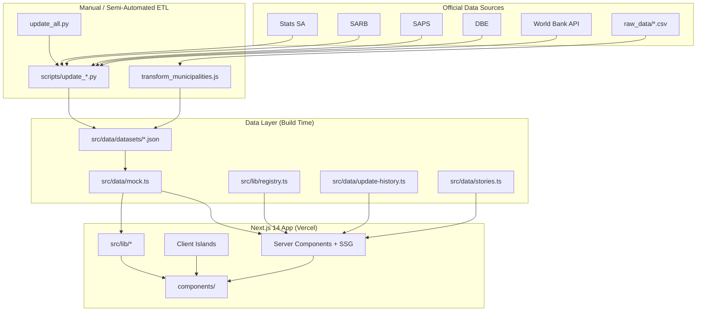
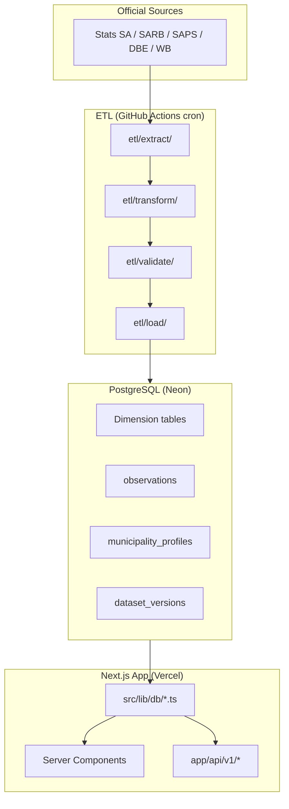
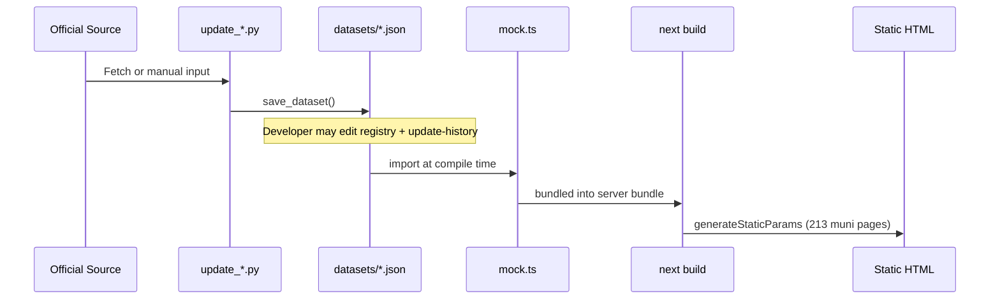
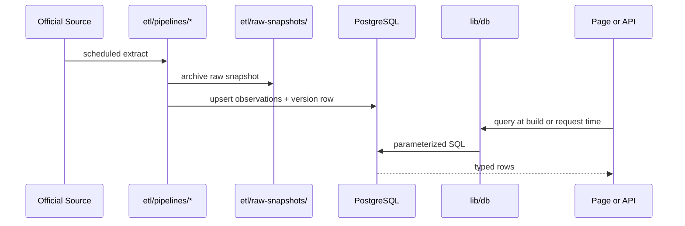
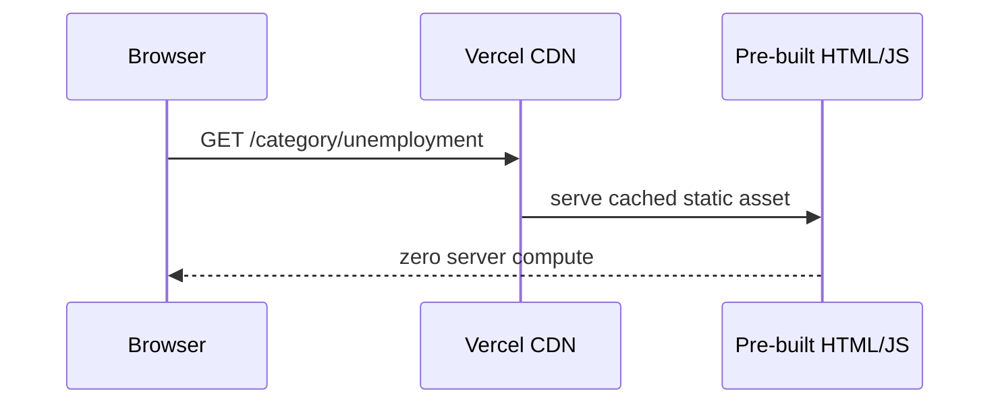
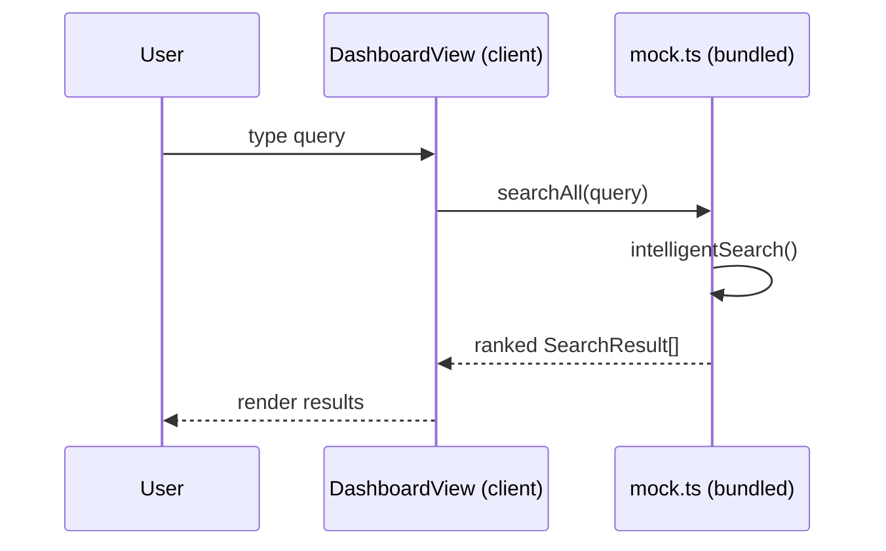
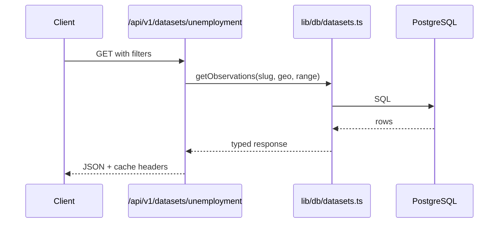
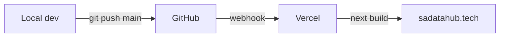

# SA Data Hub — Architecture

This document describes how SA Data Hub is built today, how it should evolve, and how data flows from official sources to the browser.

---

## Design Principles

1. **Separate data, logic, and presentation** — JSON/`mock.ts` and `lib/` are independent of JSX
2. **Static generation for slow-changing government data** — build-time SSG is correct for quarterly/annual releases
3. **Modular monolith** — one Next.js app with Route Handlers as the API; no premature microservices
4. **Metadata-driven datasets** — `registry.ts` is the single source of truth for freshness, citations, exports
5. **Incremental migration** — PostgreSQL adoption dataset-by-dataset; site always shippable

---

## Current Architecture

### High-Level Diagram



### Layer Responsibilities

| Layer | Location | Responsibility |
|-------|----------|----------------|
| **Routes** | `src/app/` | Pages, layouts, metadata, `generateStaticParams` |
| **Components** | `src/components/` | Presentation — charts, cards, layout, SEO |
| **Domain logic** | `src/lib/` | Registry, citations, insights, search, export, SEO schema |
| **Data facade** | `src/data/mock.ts` | Import JSON, expose typed query helpers |
| **Canonical data** | `src/data/datasets/` | One JSON file per logical dataset |
| **Content** | `src/data/stories.ts` | Authored narratives (not derived from stats) |
| **Update scripts** | `scripts/` | Fetch/transform official data → JSON |

### Server vs Client Boundary

| Server (default) | Client (`'use client'`) |
|------------------|-------------------------|
| Category pages | Dashboard search (`DashboardView`) |
| Province/municipality profiles | Province Explorer comparator |
| Insights/story reader | Municipality Explorer (search/filter/paginate) |
| Downloads, methodology, updates | Theme toggle, export button triggers |
| Static chart rendering | Interactive chart tooltips (Recharts) |

**Rule:** Fetch and aggregate data in server components; isolate interactivity in small client islands.

---

## Target Architecture (PostgreSQL)



### Why This Shape

- **One codebase** — pages and API share `src/lib/db/` query functions
- **Managed Postgres** — Neon free tier, branching, serverless driver already in `package.json`
- **Raw SQL first** — learn query design; optional Drizzle ORM later
- **Scheduled ETL** — GitHub Actions cron matches quarterly/monthly release cadence; no long-running ETL server

### Early PostgreSQL Work (Already in Repo)

| File | Status |
|------|--------|
| `src/lib/db/client.ts` | Neon `postgres` client with SSL |
| `src/app/api/test-db/route.ts` | Connection smoke test |
| `.neon` | Neon org/project IDs (not secrets) |
| `@neondatabase/serverless` | Installed dependency |

No production pages read from the database yet.

---

## Data Flow

### Current: JSON Pipeline



**Friction points:**

1. Four manual steps after script run: JSON, registry dates, update-history, deploy
2. No validation gate between transform and production
3. Full site rebuild for any data change
4. No audit trail beyond git history and hand-maintained log

### Target: Database Pipeline



---

## Request Flow

### Static Page Request (Current)



All category, province, municipality, and story pages are statically generated at build time via `generateStaticParams`.

### Dashboard Search (Client-Side)



Search runs entirely in the browser against bundled data — no API call.

### Future: API Request



---

## Build Flow

```bash
npm run build   # next build
```

| Step | What happens |
|------|----------------|
| Compile | TypeScript → JavaScript; JSON imported and tree-shaken |
| SSG | `generateStaticParams` for 8 categories, 9 provinces, 213 municipalities, N stories |
| Bundle | Client islands code-split; Recharts in client chunks |
| Output | `.next/` static assets deployed to Vercel |

**Build-time cost drivers:**

- 213 municipality pages (largest SSG surface)
- Large `municipalities.json` (~20k lines) bundled into server/client where imported

**Future mitigations:** ISR (`revalidate`), on-demand revalidation after ETL, DB-backed `generateStaticParams` with caching

---

## Deployment Flow



| Aspect | Detail |
|--------|--------|
| Host | Vercel |
| Domain | `sadatahub.tech` (apex canonical; `www` redirects via `next.config.js`) |
| Trigger | Push to `main` |
| Env vars | None required for JSON mode; `DATABASE_URL` for DB experiments |
| Analytics | `@vercel/analytics` in root layout |
| CI | **Not configured** — no `.github/workflows/` yet |

---

## Component Interaction

### Category Page Data Path

```
category/[slug]/page.tsx (server)
  ├── getCategoryById, getStatsByCategory     ← mock.ts
  ├── getRegistryByCategory, getDatasetStatus ← registry.ts
  ├── generateInsight, generateCategoryInsight ← insights.ts
  ├── LineChartCard, BarChartCard             ← components/charts
  ├── CitationWidget                          ← citation.ts via component
  └── ExportButton                            ← export.ts via component
```

### Municipality Profile Data Path

```
municipalities/[code]/page.tsx (server)
  ├── getMunicipalityByCode                   ← mock.ts
  ├── getMunicipalityNationalAverages         ← mock.ts (loops all 213)
  ├── generateMunicipalityInsights            ← mock.ts
  ├── generateMunicipalityIntro               ← municipality-copy.ts
  └── AgeStructureChart, HousingCompositionChart, BasicServicesChart
```

### Registry as Hub

`registry.ts` connects metadata to features without duplicating source URLs:

```
datasetRegistry
  ├── /downloads        — per-file CSV export cards
  ├── /updates          — freshness status dashboard
  ├── category pages    — dataset status badges
  ├── citation.ts       — generateDatasetCitation()
  └── search.ts         — dataset-level search results
```

---

## Repeated Patterns

| Pattern | Where | Notes |
|---------|-------|-------|
| `_meta` block in JSON | All dataset files | source, frequency, notes |
| `Statistic` + `series[]` | Category JSON files | headline value + time series |
| Registry ID = filename stem | `youth-unemployment.json` → id `youth-unemployment` | Differs from `categoryId` |
| `generateStaticParams` | categories, provinces, municipalities, stories | SEO-critical URLs |
| Rule-based insights | `insights.ts`, `mock.ts` (municipalities) | No LLM; deterministic |
| Freshness from dates | `utils.getFreshness` + registry | not hardcoded per page |

---

## Known Bottlenecks

| Issue | Impact | Mitigation |
|-------|--------|------------|
| Full rebuild on data change | Slow iteration | DB + ISR |
| In-memory municipality filtering | 213 rows OK; won't scale to wards | SQL pagination |
| World Bank scripts vs Stats SA cadence | Annual API updates ≠ quarterly QLFS | Direct Stats SA extract in ETL |
| Duplicate stat IDs across files | `youth-unemployment` in unemployment.json AND youth-unemployment.json | Normalize on migration |
| `mock.ts` name | Misleading — it's the production data facade | Rename to `data/index.ts` post-migration |
| No automated CI | Regressions ship silently | GitHub Actions lint/typecheck |

---

## What Must Not Change (Without Deliberate Planning)

- **URL structure** — `/category/[slug]`, `/provinces/[id]`, `/municipalities/[code]`, `/insights/[slug]` (SEO)
- **`lib/` separation** — citation, insights, registry remain consumers of data, not embedded in JSX
- **Component folders** — `charts/`, `ui/`, `layout/`, `seo/`
- **Three-font system** — DM Serif Display, DM Sans, DM Mono
- **Registry-driven downloads/citations** — one registry entry enables all V4 features

---

## Architecture Decision Records

Future ADRs should live in `docs/decisions/`. Recommended first entries:

1. Fact/dimension model vs table-per-dataset (see [database-schema.md](./database-schema.md))
2. Wide `municipality_profiles` vs key-value for census indicators
3. Modular monolith vs separate API service

The root [SA-Data-Hub-Architecture-Review.md](../SA-Data-Hub-Architecture-Review.md) contains the original reasoning for the fact/dimension approach.
