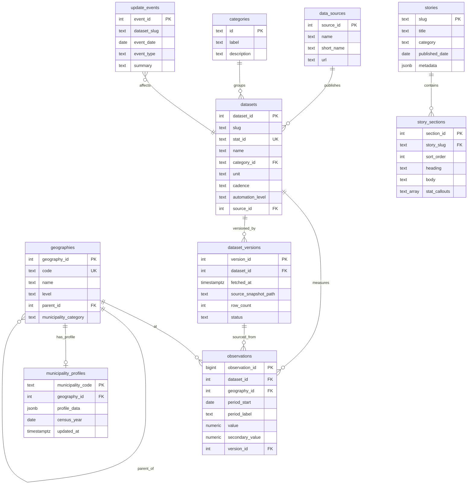

# SA Data Hub — PostgreSQL Schema Design

This document defines the target PostgreSQL schema for SA Data Hub. It is designed for a solo developer building a production-quality data platform — normalized where it helps query reuse, pragmatically denormalized where it does not.

---

## Design Philosophy

### Central decision: fact/dimension model for time series

Most national and provincial indicators share the same shape:

> **An indicator, measured for a geography, at a point in time.**

Unemployment in Gauteng Q1 2024, CPI headline in May 2025, matric pass rate nationally in 2024 — all are observations. Modeling each category as a bespoke table would duplicate query logic across charts, exports, registry, and API.

### Exception: municipality census profiles

Municipality data is a **cross-sectional wide profile** (50+ fields per entity, two census years) rather than a long time series. A dedicated `municipality_profiles` table preserves the current JSON shape and avoids creating 50+ synthetic dataset rows per municipality.

### Content tables

Stories and platform changelog are **authored content**, not statistical observations. They get separate tables.

---

## Entity Relationship Diagram



---

## Table Definitions

### `data_sources`

**Why:** Provenance is a first-class concern (citations, methodology page). Normalizing sources prevents URL/name drift across 30+ statistics.

| Column | Type | Constraints | Description |
|--------|------|-------------|-------------|
| `source_id` | `SERIAL` | PRIMARY KEY | Surrogate key |
| `name` | `TEXT` | NOT NULL | Full name, e.g. "Statistics South Africa" |
| `short_name` | `TEXT` | NOT NULL | e.g. "Stats SA" |
| `url` | `TEXT` | | Official homepage or publication index |
| `notes` | `TEXT` | | Optional methodology notes |

**Example row:**

| source_id | name | short_name | url |
|-----------|------|------------|-----|
| 1 | Statistics South Africa | Stats SA | https://www.statssa.gov.za |

---

### `categories`

**Why:** Maps to UI category pages (`/category/unemployment`). Stable string IDs match existing `CategoryId` type.

| Column | Type | Constraints | Description |
|--------|------|-------------|-------------|
| `id` | `TEXT` | PRIMARY KEY | Slug: `unemployment`, `gdp`, etc. |
| `label` | `TEXT` | NOT NULL | Display name |
| `description` | `TEXT` | NOT NULL | Category card description |
| `icon` | `TEXT` | NOT NULL | Lucide icon name |
| `color` | `TEXT` | | Tailwind color class |
| `bg_color` | `TEXT` | | Tailwind background class |
| `sort_order` | `SMALLINT` | NOT NULL DEFAULT 0 | Homepage grid order |

**Example row:**

| id | label | description |
|----|-------|-------------|
| unemployment | Unemployment | Labour force participation, jobless rates… |

---

### `geographies`

**Why:** National → province → municipality is a hierarchy. One self-referencing table supports recursive queries and future ward-level data without schema changes.

| Column | Type | Constraints | Description |
|--------|------|-------------|-------------|
| `geography_id` | `SERIAL` | PRIMARY KEY | Surrogate key |
| `code` | `TEXT` | UNIQUE NOT NULL | Official code: `ZA`, `WC`, `CPT`, `WC011` |
| `name` | `TEXT` | NOT NULL | Display name |
| `level` | `TEXT` | NOT NULL CHECK | `national`, `province`, `municipality`, `district` |
| `parent_id` | `INT` | REFERENCES geographies(geography_id) | Parent in hierarchy |
| `slug` | `TEXT` | UNIQUE | URL slug for provinces: `western-cape` |
| `municipality_category` | `CHAR(1)` | | `A`, `B`, `C` for municipalities; NULL otherwise |
| `province_code` | `CHAR(3)` | | Stats SA code: `WC`, `GP`, etc. |

**Indexes:**

```sql
CREATE INDEX idx_geographies_parent ON geographies (parent_id);
CREATE INDEX idx_geographies_level ON geographies (level);
CREATE INDEX idx_geographies_slug ON geographies (slug) WHERE slug IS NOT NULL;
```

**Example rows:**

| code | name | level | parent_id | slug |
|------|------|-------|-----------|------|
| ZA | South Africa | national | NULL | NULL |
| WC | Western Cape | province | 1 | western-cape |
| CPT | City of Cape Town | municipality | 2 | NULL |

---

### `datasets`

**Why:** Combines registry metadata with per-statistic identity. Each `Statistic.id` from JSON becomes a dataset row (the measurable indicator).

| Column | Type | Constraints | Description |
|--------|------|-------------|-------------|
| `dataset_id` | `SERIAL` | PRIMARY KEY | Surrogate key |
| `slug` | `TEXT` | NOT NULL | Registry/file stem: `unemployment`, `youth-unemployment` |
| `stat_id` | `TEXT` | UNIQUE NOT NULL | App statistic ID: `unemployment-national` |
| `name` | `TEXT` | NOT NULL | Display title |
| `description` | `TEXT` | | Long description |
| `category_id` | `TEXT` | REFERENCES categories(id) | UI category |
| `source_id` | `INT` | REFERENCES data_sources(source_id) | Primary source |
| `unit` | `TEXT` | NOT NULL | `%`, `cases`, `million`, `ZAR billion` |
| `cadence` | `TEXT` | NOT NULL | `monthly`, `quarterly`, `annual`, `decennial`, `static` |
| `automation_level` | `TEXT` | NOT NULL | `auto`, `semi-auto`, `manual`, `static` |
| `geographic_level` | `TEXT` | NOT NULL DEFAULT 'national' | `national`, `provincial`, `municipal` |
| `publication_name` | `TEXT` | | e.g. "Quarterly Labour Force Survey" |
| `source_url` | `TEXT` | | Deep link to publication |
| `notes` | `TEXT` | | Caveats from `_meta.notes` |
| `series_start_label` | `TEXT` | | Earliest period label |
| `series_end_label` | `TEXT` | | Latest period label |
| `search_vector` | `TSVECTOR` | GENERATED | Full-text search on name + description |
| `created_at` | `TIMESTAMPTZ` | NOT NULL DEFAULT now() | |
| `updated_at` | `TIMESTAMPTZ` | NOT NULL DEFAULT now() | |

**Indexes:**

```sql
CREATE INDEX idx_datasets_slug ON datasets (slug);
CREATE INDEX idx_datasets_category ON datasets (category_id);
CREATE INDEX idx_datasets_search ON datasets USING GIN (search_vector);
```

**Note:** `slug` is indexed but **not unique** — multiple `Statistic.id` rows share one registry JSON file (e.g. four stats under `youth-unemployment`). ETL and queries use `stat_id` as the primary lookup key.

---

### `observations`

**Why:** The central fact table. All time series values live here. Grows with releases but remains small (low hundreds of thousands of rows).

| Column | Type | Constraints | Description |
|--------|------|-------------|-------------|
| `observation_id` | `BIGSERIAL` | PRIMARY KEY | |
| `dataset_id` | `INT` | NOT NULL REFERENCES datasets(dataset_id) | Which indicator |
| `geography_id` | `INT` | NOT NULL REFERENCES geographies(geography_id) | Where |
| `period_start` | `DATE` | NOT NULL | Normalized sortable date |
| `period_label` | `TEXT` | NOT NULL | Display: `Q1 2024`, `2022`, `May 2025` |
| `value` | `NUMERIC` | NOT NULL | Primary value |
| `secondary_value` | `NUMERIC` | | Optional (e.g. expanded unemployment) |
| `is_estimate` | `BOOLEAN` | NOT NULL DEFAULT FALSE | Modelled vs official |
| `version_id` | `INT` | REFERENCES dataset_versions(version_id) | Provenance |
| `created_at` | `TIMESTAMPTZ` | NOT NULL DEFAULT now() | |

**Unique constraint (idempotent upserts):**

```sql
UNIQUE (dataset_id, geography_id, period_start)
```

**Indexes:**

```sql
CREATE INDEX idx_observations_dataset_geo_period
    ON observations (dataset_id, geography_id, period_start);

CREATE INDEX idx_observations_latest
    ON observations (dataset_id, geography_id, period_start DESC);
```

**Period normalization rules:**

| Label format | `period_start` |
|--------------|----------------|
| `Q1 2024` | `2024-01-01` |
| `Q2 2024` | `2024-04-01` |
| `Q3 2024` | `2024-07-01` |
| `Q4 2024` | `2024-10-01` |
| `2024` | `2024-01-01` |
| `Jan 2025` | `2025-01-01` |
| `2017/18` (SAPS FY) | `2017-04-01` |

**Example rows:**

| dataset_id | geography_id | period_start | period_label | value |
|------------|--------------|--------------|--------------|-------|
| 1 | 1 (ZA) | 2025-10-01 | Q4 2025 | 31.4 |
| 1 | 3 (WC) | 2025-07-01 | Q3 2025 | 19.7 |

---

### `statistic_snapshots`

**Why:** JSON `Statistic` objects carry presentation fields (`value` as formatted string, `change`, `trend`, `changeLabel`) that are derived from the latest two observations. Materializing snapshots avoids recomputing on every page load and preserves the exact headline semantics the UI expects.

| Column | Type | Constraints | Description |
|--------|------|-------------|-------------|
| `stat_id` | `TEXT` | PRIMARY KEY REFERENCES datasets(stat_id) | |
| `display_value` | `TEXT` | NOT NULL | e.g. `31.4%` |
| `raw_value` | `NUMERIC` | NOT NULL | |
| `change` | `NUMERIC` | | Delta from prior period |
| `change_label` | `TEXT` | | e.g. `from Q3 2025` |
| `trend` | `TEXT` | NOT NULL CHECK | `up`, `down`, `stable` |
| `last_updated` | `DATE` | NOT NULL | Publication date |
| `computed_at` | `TIMESTAMPTZ` | NOT NULL DEFAULT now() | |

**Alternative:** Compute snapshots in `lib/db` from observations via window functions. Start with materialized view; promote to table if needed.

---

### `dataset_versions`

**Why:** Replaces `src/data/update-history.ts` with machine-written audit rows on every ETL run.

| Column | Type | Constraints | Description |
|--------|------|-------------|-------------|
| `version_id` | `SERIAL` | PRIMARY KEY | |
| `dataset_id` | `INT` | REFERENCES datasets(dataset_id) | NULL for full-pipeline runs |
| `slug` | `TEXT` | | Registry slug for multi-stat files |
| `fetched_at` | `TIMESTAMPTZ` | NOT NULL DEFAULT now() | |
| `source_snapshot_path` | `TEXT` | | Path/URL to raw extract |
| `row_count` | `INT` | | Observations written |
| `status` | `TEXT` | NOT NULL | `success`, `partial`, `failed` |
| `notes` | `TEXT` | | Error messages or diff summary |
| `duration_ms` | `INT` | | ETL timing |

---

### `update_events`

**Why:** Human-readable changelog for `/updates` page. Can be auto-generated from `dataset_versions` or manually enriched for methodology changes.

| Column | Type | Constraints | Description |
|--------|------|-------------|-------------|
| `event_id` | `SERIAL` | PRIMARY KEY | |
| `dataset_slug` | `TEXT` | NOT NULL | Registry ID |
| `event_date` | `DATE` | NOT NULL | |
| `event_type` | `TEXT` | NOT NULL | `data-update`, `methodology-change`, `new-dataset`, `correction` |
| `summary` | `TEXT` | NOT NULL | |
| `source_url` | `TEXT` | | |

---

### `municipality_profiles`

**Why:** Census municipality data is wide, mostly static, and powers a dedicated UI unlike national time-series charts. Storing as JSONB allows schema flexibility while keeping 213 rows queryable.

| Column | Type | Constraints | Description |
|--------|------|-------------|-------------|
| `municipality_code` | `TEXT` | PRIMARY KEY | e.g. `CPT`, `WC011` |
| `geography_id` | `INT` | NOT NULL REFERENCES geographies(geography_id) | |
| `name` | `TEXT` | NOT NULL | Official name |
| `province_code` | `CHAR(3)` | NOT NULL | |
| `category` | `CHAR(1)` | NOT NULL | A/B/C |
| `census_year` | `SMALLINT` | NOT NULL DEFAULT 2022 | |
| `profile_data` | `JSONB` | NOT NULL | Full `MunicipalityRecord` minus indexed columns |
| `population_2022` | `INT` | | Denormalized for sorting |
| `population_density_2022` | `NUMERIC(10,1)` | | Denormalized for sorting |
| `last_updated` | `DATE` | NOT NULL | |
| `erratum_applied` | `BOOLEAN` | NOT NULL DEFAULT FALSE | |
| `updated_at` | `TIMESTAMPTZ` | NOT NULL DEFAULT now() | |

**Indexes:**

```sql
CREATE INDEX idx_muni_province ON municipality_profiles (province_code);
CREATE INDEX idx_muni_category ON municipality_profiles (category);
CREATE INDEX idx_muni_population ON municipality_profiles (population_2022 DESC);
CREATE INDEX idx_muni_name_trgm ON municipality_profiles USING GIN (name gin_trgm_ops);
-- Requires: CREATE EXTENSION pg_trgm;
```

**Normalization decision:** Hot filter/sort columns are extracted; full nested detail (`housingDetail`, `serviceDetail`) stays in JSONB to avoid 40+ join tables for census cross-tabs.

---

### `province_snapshots`

**Why:** `provinces.json` mixes QLFS unemployment, census population, DBE matric, and housing into one profile object. A snapshot table maps cleanly to `ProvinceData` TypeScript type.

| Column | Type | Constraints | Description |
|--------|------|-------------|-------------|
| `province_slug` | `TEXT` | PRIMARY KEY | `western-cape` |
| `geography_id` | `INT` | NOT NULL REFERENCES geographies(geography_id) | |
| `snapshot_data` | `JSONB` | NOT NULL | Full `ProvinceData` object |
| `unemployment_rate` | `NUMERIC(5,1)` | | Denormalized for ranking |
| `unemployment_rank` | `SMALLINT` | | |
| `population` | `INT` | | |
| `period_label` | `TEXT` | | QLFS period for unemployment |
| `updated_at` | `TIMESTAMPTZ` | NOT NULL DEFAULT now() | |

**Long-term:** Decompose into observations per indicator; keep snapshot during migration for equivalence testing.

---

### `stories` and `story_sections`

**Why:** Data stories are authored content with structured sections and stat callout references.

**`stories`:**

| Column | Type | Constraints |
|--------|------|-------------|
| `slug` | `TEXT` | PRIMARY KEY |
| `title` | `TEXT` | NOT NULL |
| `subtitle` | `TEXT` | |
| `category` | `TEXT` | NOT NULL |
| `category_label` | `TEXT` | NOT NULL |
| `summary` | `TEXT` | NOT NULL |
| `reading_time_minutes` | `SMALLINT` | NOT NULL |
| `published_date` | `DATE` | NOT NULL |
| `last_updated` | `DATE` | NOT NULL |
| `featured` | `BOOLEAN` | NOT NULL DEFAULT FALSE |
| `cover_emoji` | `TEXT` | |
| `tags` | `TEXT[]` | |
| `related_stat_ids` | `TEXT[]` | |
| `related_slugs` | `TEXT[]` | |

**`story_sections`:**

| Column | Type | Constraints |
|--------|------|-------------|
| `section_id` | `SERIAL` | PRIMARY KEY |
| `story_slug` | `TEXT` | NOT NULL REFERENCES stories(slug) ON DELETE CASCADE |
| `sort_order` | `SMALLINT` | NOT NULL |
| `section_key` | `TEXT` | NOT NULL |
| `heading` | `TEXT` | NOT NULL |
| `body` | `TEXT` | NOT NULL |
| `highlight` | `TEXT` | |
| `stat_callouts` | `TEXT[]` | |

---

### `platform_changelog`

**Why:** Versioned platform releases (distinct from dataset updates).

| Column | Type | Constraints |
|--------|------|-------------|
| `version` | `TEXT` | PRIMARY KEY |
| `release_date` | `DATE` | NOT NULL |
| `title` | `TEXT` | NOT NULL |
| `summary` | `TEXT` | NOT NULL |
| `features` | `TEXT[]` | NOT NULL |

---

## Supporting Views (Recommended)

### `v_latest_observations`

```sql
CREATE VIEW v_latest_observations AS
SELECT DISTINCT ON (dataset_id, geography_id)
    observation_id, dataset_id, geography_id,
    period_start, period_label, value, secondary_value
FROM observations
ORDER BY dataset_id, geography_id, period_start DESC;
```

### `v_dataset_freshness`

Joins latest `dataset_versions` with `datasets` to power registry freshness without TypeScript date math.

---

## What We Deliberately Did Not Add

| Feature | Reason |
|---------|--------|
| Table partitioning | <500k rows expected for years |
| TimescaleDB | No streaming/time-series DB needed |
| Read replicas | Solo dev; Vercel + Neon free tier sufficient |
| Prisma (initially) | Raw SQL teaches query design; Drizzle optional later |
| Separate `provinces` and `municipalities` tables | `geographies` hierarchy is more flexible |

---

## Migration Mapping Summary

| JSON source | Target table(s) |
|-------------|-----------------|
| `*.json` → `statistics[]` | `datasets`, `observations`, `statistic_snapshots` |
| `provinces.json` | `province_snapshots` (+ observations long-term) |
| `municipalities.json` | `geographies`, `municipality_profiles` |
| `registry.ts` | `datasets` metadata columns |
| `update-history.ts` | `update_events`, `dataset_versions` |
| `stories.ts` | `stories`, `story_sections` |
| `changelog.ts` | `platform_changelog` |

See [dataset-analysis.md](./dataset-analysis.md) for per-file field mapping and [migration-plan.md](./migration-plan.md) for execution order.
