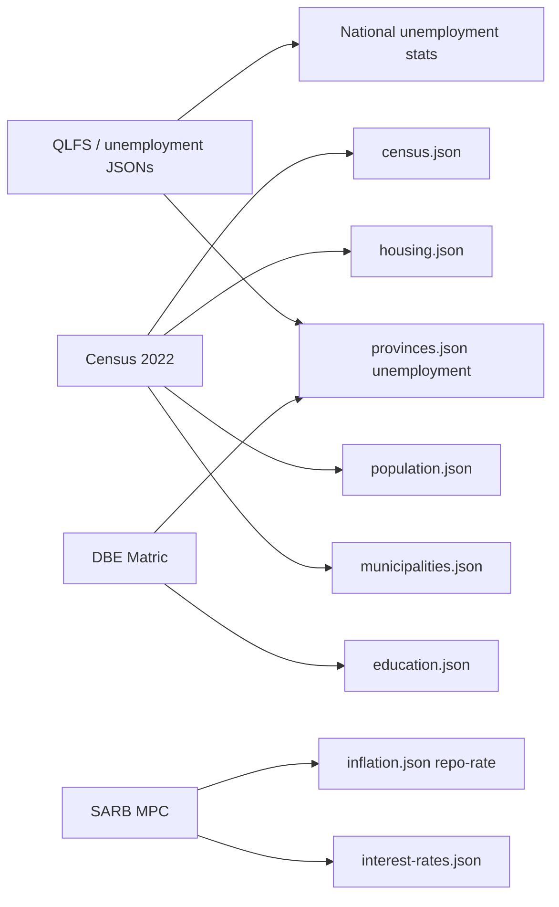

# SA Data Hub — Dataset Analysis

Per-dataset documentation for all JSON files in `src/data/datasets/`. This analysis informs ETL design, PostgreSQL migration, and data quality fixes.

---

## Common Structures

### Pattern A: Time-series statistics (`statistics[]`)

Used by 11 of 13 JSON files. Each file contains:

```json
{
  "_meta": { "source", "source_url", "update_frequency", "last_verified", "notes" },
  "statistics": [ /* Statistic objects */ ]
}
```

**`Statistic` shape (TypeScript: `src/types/index.ts`):**

| Field | Type | Purpose |
|-------|------|---------|
| `id` | string | Unique app identifier |
| `categoryId` | CategoryId | UI category page |
| `title` | string | Display heading |
| `value` | string | Formatted headline |
| `rawValue` | number | Machine value |
| `unit` | string | `%`, `cases`, etc. |
| `change` | number | Delta vs prior period |
| `changeLabel` | string | Human context |
| `trend` | `up` \| `down` \| `stable` | Direction |
| `description` | string | Prose explanation |
| `source` | DataSource | Citation metadata |
| `lastUpdated` | ISO date | Publication date |
| `series` | DataSeries[] | Optional time series |
| `province` | Province | Optional filter (rare) |

**`DataSeries`:**

| Field | Type |
|-------|------|
| `name` | string |
| `unit` | string |
| `data` | `{ label, value, secondaryValue? }[]` |
| `color` | optional chart color |

### Pattern B: Provincial profiles (`provinces[]`)

File: `provinces.json`. Array of `ProvinceData` objects with nested `stats` block.

### Pattern C: Municipality census (`municipalities[]`)

File: `municipalities.json`. Array of `MunicipalityRecord` — wide cross-sectional profile.

### Shared `_meta` conventions

| Field | Present in | Notes |
|-------|------------|-------|
| `source` | All | Human-readable source name |
| `source_url` | Most | Deep link |
| `update_frequency` | All | Human-readable cadence |
| `last_verified` | All | When maintainer last checked |
| `notes` | All | Caveats, update instructions |

---

## Registry vs Category vs File

| Concept | Example | Count |
|---------|---------|-------|
| UI category | `unemployment` | 8 |
| Registry dataset (file stem) | `youth-unemployment` | 12 |
| JSON file | `youth-unemployment.json` | 13 (+ municipalities) |
| Statistic | `youth-neet-rate` | ~34 total |

**Key inconsistency:** Multiple registry entries share one `categoryId` (e.g. unemployment, youth-unemployment, labour-force → all `unemployment`).

---

## Per-Dataset Analysis

### 1. `unemployment.json`

| Attribute | Value |
|-----------|-------|
| **Registry ID** | `unemployment` |
| **Category** | `unemployment` |
| **Source** | Stats SA QLFS (P0211) |
| **Update frequency** | Quarterly (Feb, May, Aug, Nov) |
| **Geographic granularity** | National |
| **Time granularity** | Quarterly (`Q1 2022` … `Q4 2025`) |
| **Automation** | `semi-auto` |
| **Update script** | `scripts/update_unemployment.py` |

**Statistics (3):**

| stat_id | Unit | Series |
|---------|------|--------|
| `unemployment-national` | % | 16 quarterly points |
| `youth-unemployment` | % | quarterly (duplicate ID exists in youth file) |
| `labour-force-participation` | % | quarterly |

**Validation rules:**

- `rawValue` between 0 and 100 for rates
- Quarterly labels match `/^Q[1-4] \d{4}$/`
- `trend` consistent with sign of `change`

**Script limitation:** `update_unemployment.py` fetches **World Bank annual** estimates, not Stats SA quarterly. Script prints warning; quarterly series preserved manually.

**PostgreSQL mapping:**

- 3 rows in `datasets`
- Observations: `geography_id` = national (ZA), one row per quarter per stat
- `statistic_snapshots` from latest two quarters

**Fix before migration:** Remove duplicate `youth-unemployment` stat from this file OR from `youth-unemployment.json`; keep one canonical home.

---

### 2. `youth-unemployment.json`

| Attribute | Value |
|-----------|-------|
| **Registry ID** | `youth-unemployment` |
| **Category** | `unemployment` |
| **Source** | Stats SA QLFS |
| **Update frequency** | Quarterly |
| **Geographic granularity** | National |
| **Time granularity** | Quarterly |
| **Automation** | `semi-auto` |
| **Update script** | None dedicated (covered by unemployment updater partially) |

**Statistics (4):**

| stat_id | Description |
|---------|-------------|
| `youth-unemployment-narrow` | Ages 15–34 |
| `youth-unemployment-1524` | Ages 15–24 |
| `youth-unemployment-expanded` | Expanded definition |
| `youth-neet-rate` | NEET rate |

**Inconsistency:** `unemployment.json` also contains `id: youth-unemployment` — different statistic than `youth-unemployment-narrow`.

---

### 3. `labour-force.json`

| Attribute | Value |
|-----------|-------|
| **Registry ID** | `labour-force` |
| **Category** | `unemployment` |
| **Source** | Stats SA QLFS |
| **Statistics** | `lfpr-overall`, `female-labour-participation` |
| **Time granularity** | Quarterly |
| **Automation** | `semi-auto` |

**PostgreSQL:** 2 datasets; observations at national level.

---

### 4. `inflation.json`

| Attribute | Value |
|-----------|-------|
| **Registry ID** | `inflation` |
| **Category** | `inflation` |
| **Source** | Stats SA CPI (P0141); repo rate from SARB |
| **Update frequency** | Monthly (CPI ~22nd); MPC ~6×/year |
| **Geographic granularity** | National |
| **Time granularity** | Monthly (`May 2025`) and annual |
| **Automation** | `semi-auto` |
| **Update script** | `scripts/update_inflation.py` |

**Statistics (4):**

| stat_id | Notes |
|---------|-------|
| `cpi-headline` | Monthly YoY % |
| `food-inflation` | Monthly |
| `repo-rate` | **Cross-category:** SARB rate in inflation file |
| `annual-cpi-avg` | Annual average |

**Script limitation:** World Bank annual CPI; monthly headline requires manual Stats SA update.

**Inconsistency:** `repo-rate` in inflation.json vs `repo-rate-sarb` in `interest-rates.json` — overlapping SARB data in two categories.

---

### 5. `gdp.json`

| Attribute | Value |
|-----------|-------|
| **Registry ID** | `gdp` |
| **Category** | `gdp` |
| **Source** | Stats SA GDP (P0441) |
| **Update frequency** | Quarterly (~65 days after quarter end) |
| **Geographic granularity** | National |
| **Time granularity** | Quarterly + annual |
| **Automation** | `semi-auto` |
| **Update script** | `scripts/update_gdp.py` |

**Statistics (4):** `gdp-growth`, `gdp-annual-growth`, `gdp-nominal`, `gdp-per-capita`

**Units:** `%` for growth; `ZAR billion` for nominal; `ZAR` for per capita

**Script note:** World Bank USD/ZAR; ZAR figures should be verified against Stats SA.

**`_meta.release_calendar`:** Unique to this file — Q1→June, Q2→September, etc.

---

### 6. `interest-rates.json`

| Attribute | Value |
|-----------|-------|
| **Registry ID** | `interest-rates` |
| **Category** | `gdp` (UI grouping) |
| **Source** | SARB MPC |
| **Update frequency** | ~Every 2 months (MPC meetings) |
| **Geographic granularity** | National |
| **Time granularity** | Per decision date |
| **Automation** | `semi-auto` |
| **Update script** | `scripts/update_interest_rates.py` (manual rate constant) |

**Statistics (2):** `repo-rate-sarb`, `prime-lending-rate`

**Validation:** `prime` ≈ `repo` + 3.5%

---

### 7. `crime.json`

| Attribute | Value |
|-----------|-------|
| **Registry ID** | `crime` |
| **Category** | `crime` |
| **Source** | SAPS Crime Statistics |
| **Update frequency** | Annual (September, Apr–Mar FY) |
| **Geographic granularity** | National (provincial breakdown not in current stats) |
| **Time granularity** | Financial year `2017/18` … |
| **Automation** | `manual` |
| **Update script** | `scripts/update_crime.py` |

**Statistics (3):** `murder-rate`, `crime-contact`, `crime-robbery`

**Units:** `cases` (absolute counts, not per-100k in headline)

**Missing values:** SAPS has no API; manual Excel extraction required.

---

### 8. `education.json`

| Attribute | Value |
|-----------|-------|
| **Registry ID** | `education` |
| **Category** | `education` |
| **Source** | DBE NSC Results; Stats SA Census (literacy) |
| **Update frequency** | Annual (matric January); literacy decennial |
| **Geographic granularity** | National |
| **Time granularity** | Annual |
| **Automation** | `manual` |
| **Update script** | `scripts/update_education.py` |

**Statistics (3):** `matric-pass-rate`, `education-literacy`, `higher-education-enrolment`

---

### 9. `population.json`

| Attribute | Value |
|-----------|-------|
| **Registry ID** | `population` |
| **Category** | `population` |
| **Source** | Stats SA Census 2022 + Mid-Year Estimates (P0302) |
| **Update frequency** | Annual (mid-year July) |
| **Geographic granularity** | National |
| **Time granularity** | Annual |
| **Automation** | `auto` |
| **Update script** | `scripts/update_population.py` |

**Statistics (3):** `population-total` (millions), `population-urban` (%), `population-median-age` (years)

**Note:** `_meta.auto_updated` field unique to this file.

---

### 10. `housing.json`

| Attribute | Value |
|-----------|-------|
| **Registry ID** | `housing` |
| **Category** | `housing` |
| **Source** | Stats SA Census 2022 + GHS (P0318) |
| **Update frequency** | Annual (GHS); decennial (Census) |
| **Geographic granularity** | National |
| **Time granularity** | Mixed annual + census snapshot |
| **Automation** | `manual` |
| **Update script** | `scripts/update_housing.py` |

**Statistics (3):** piped water, electricity, formal dwellings (%)

---

### 11. `census.json`

| Attribute | Value |
|-----------|-------|
| **Registry ID** | `census` |
| **Category** | `census` |
| **Source** | Stats SA Census 2022 |
| **Update frequency** | Decennial (~2032) |
| **Geographic granularity** | National |
| **Time granularity** | Census years (2001, 2011, 2022) |
| **Automation** | `static` |
| **Update script** | `scripts/update_census.py` |

**Statistics (3):** households, internet access, no-income households

---

### 12. `provinces.json`

| Attribute | Value |
|-----------|-------|
| **Registry ID** | `provinces` |
| **Category** | None (download-only + province pages) |
| **Source** | Stats SA QLFS + Census + DBE (composite) |
| **Update frequency** | Quarterly (unemployment component) |
| **Geographic granularity** | Provincial (9 provinces) |
| **Time granularity** | Mixed — QLFS quarter, census year, matric year |
| **Automation** | `semi-auto` |
| **Update script** | None — manual composite |

**Records:** 9 provinces with `ProvinceData` shape

**Inconsistency:** `unemploymentRate` top-level vs `stats.unemployment.rate`; `stats.unemployment.period` is `Q3 2025` while national unemployment file shows `Q4 2025`.

**PostgreSQL:** `province_snapshots` table; long-term decompose to observations per indicator × province.

---

### 13. `municipalities.json`

| Attribute | Value |
|-----------|-------|
| **Registry ID** | Not in registry (municipalities export separate) |
| **Source** | Stats SA Census 2022 Municipal Fact Sheet; afrith CSV extract |
| **Update frequency** | Decennial |
| **Geographic granularity** | Municipal (213 local municipalities) |
| **Time granularity** | 2011 and 2022 census (boundary-aligned) |
| **Automation** | `static` |
| **Transform script** | `scripts/transform_municipalities.js` |

**Raw inputs:**

| File | Content |
|------|---------|
| `raw_data/person-indicators-muni.csv` | Population, households |
| `raw_data/housing-info-muni.csv` | Dwelling types, services |
| `raw_data/age-distribution-muni.csv` | Age cohorts |

**Record count:** 213 (8 metros Category A, 205 local Category B)

**Excluded themes (per `_meta`):** employment, income, fertility, mortality, water_interruptions

**Erratum:** MP325 (Thaba Chweu), MP322 (Mbombela) — `erratumApplied: true`

**Field groups per record:**

| Group | Examples | Units |
|-------|----------|-------|
| Identity | id, name, category, province | codes |
| Population | population2022, growth rate, density | count, %, per km² |
| Households | households2022, avgHouseholdSize | count, persons |
| Age % | pctAge0to14_2022, pctAge15to34_2022 | % |
| Housing % | pctFormalDwelling, pctInformalDwelling | % |
| Services % | pctWaterScheme, pctFlushToilet, pctElectricityCooking | % |
| Detail sub-objects | populationDetail, housingDetail, serviceDetail | raw counts |

**PostgreSQL:** `municipality_profiles` JSONB + denormalized sort columns; `geographies` rows for each municipality.

---

## Cross-Dataset Relationships



---

## Naming Inconsistencies to Fix

| Issue | Location | Recommendation |
|-------|----------|----------------|
| Duplicate `youth-unemployment` stat ID | unemployment.json vs youth-unemployment.json | Rename to distinct IDs |
| `repo-rate` vs `repo-rate-sarb` | inflation.json vs interest-rates.json | Single canonical SARB dataset |
| `labour-force-participation` in unemployment.json | Should be in labour-force.json | Move stat to match registry |
| `mock.ts` filename | Production data facade | Rename after DB migration |
| README says Next.js 15 | package.json has 14.2.3 | Align docs |
| World Bank scripts labeled `auto` | Don't update quarterly series | Reclassify automation_level or fix extract |
| Provincial Q3 vs national Q4 unemployment | provinces.json vs unemployment.json | Sync on each QLFS release |
| `automationLevel` in methodology vs registry | `full/partial` vs `auto/semi-auto` | Unify enum |

---

## Duplicate Logic Opportunities

| Logic | Current locations | Normalize to |
|-------|-------------------|--------------|
| Period label parsing | `registry.ts`, ETL needed | `lib/periods.ts` or SQL function |
| World Bank fetch | Each `update_*.py` | `scripts/wb_client.py` or `etl/extract/world_bank.py` |
| Freshness status | `utils.ts`, `registry.ts` | DB view + shared function |
| Province code ↔ slug | `utils.ts` | DB `geographies.slug` |
| CSV export | `export.ts` | API endpoint reusing same builder |
| `_meta` preservation | `utils.save_dataset` | ETL load stage metadata merge |

---

## Common Validation Rules (ETL)

```python
# Pseudocode — apply in etl/validate/
RULES = {
    "percent": lambda v: 0 <= v <= 100,
    "rate_trend": lambda change, trend: (
        (change > 0 and trend == "up") or
        (change < 0 and trend == "down") or
        (change == 0 and trend == "stable")
    ),
    "quarterly_label": r"^Q[1-4] \d{4}$",
    "monthly_label": r"^[A-Z][a-z]{2} \d{4}$",
    "fy_label": r"^\d{4}/\d{2}$",
}
```

**Fail loudly:** Reject load if >0% of rows fail validation (configurable per dataset).

---

## Data Volume Estimates

| Dataset | Observations (est.) |
|---------|---------------------|
| Quarterly stats × 16 periods × 1 geo | ~16 per stat |
| All national time series | ~2,000 |
| Provincial (future per-indicator) | ~18,000 |
| Municipality profiles | 213 rows (not observations) |

Total `observations` table: **< 50,000 rows** for foreseeable future — trivial for PostgreSQL.

---

## Pre-Migration Checklist

- [ ] Resolve duplicate stat IDs across JSON files
- [ ] Align provincial unemployment period with national QLFS
- [ ] Document authoritative source for each series (Stats SA vs World Bank)
- [ ] Add JSON Schema files in `etl/schemas/` for each dataset shape
- [ ] Archive raw snapshots on every ETL run
- [ ] Write equivalence tests: JSON export == DB query export per dataset
