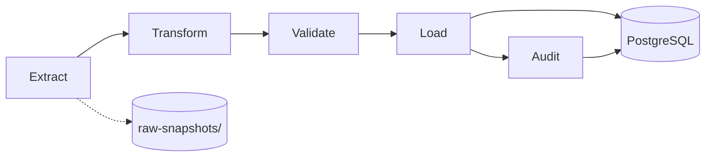

# SA Data Hub — ETL Pipeline Design

Reusable extract → transform → validate → load architecture for moving official South African statistics from source systems into PostgreSQL.

---

## Goals

1. **Idempotent** — re-running a pipeline does not duplicate data
2. **Auditable** — every load writes a version row and archives raw input
3. **Validated** — bad data fails before reaching production
4. **Consistent** — shared libraries for HTTP, periods, units, and upserts
5. **Schedulable** — GitHub Actions cron, no long-running server

---

## Pipeline Stages



### Extract

**Purpose:** Fetch or read authoritative source data into an untouched raw format.

| Source type | Method | Output |
|-------------|--------|--------|
| World Bank API | HTTP GET | `etl/raw-snapshots/{slug}/{timestamp}.json` |
| Stats SA bulk | Download CSV/Excel | Raw file archive |
| SAPS / DBE | Manual download → committed file | `etl/raw-snapshots/{slug}/manual-{date}.xlsx` |
| Municipality CSVs | `raw_data/*.csv` | Already in repo; copy to snapshot on transform |

**Rules:**

- Never mutate raw snapshots after write
- Include `extracted_at`, `source_url`, `extractor_version` in sidecar metadata
- Rate-limit HTTP (reuse `scripts/utils.py` fetch with backoff)

### Transform

**Purpose:** Map raw input to canonical internal shape matching PostgreSQL load contract.

**Output contract (per observation):**

```typescript
interface LoadObservation {
  statId: string           // maps to datasets.stat_id
  geographyCode: string    // ZA, WC, CPT, etc.
  periodLabel: string      // Q4 2025
  periodStart: string      // ISO date
  value: number
  secondaryValue?: number
  isEstimate?: boolean
}
```

**Transform responsibilities:**

- Type coercion (string → number)
- Unit normalization (millions → absolute, % vs proportion)
- Period label → `period_start` date (shared `periods.py`)
- Geography code validation against `geographies` seed
- Dedup by natural key

**Municipality transform:** Keep existing `transform_municipalities.js` logic; output `municipality_profiles` load format instead of/in addition to JSON.

### Validate

**Purpose:** Fail loudly before load.

| Check | Action on failure |
|-------|-------------------|
| JSON Schema / pydantic model | Abort load |
| Value range (%, counts > 0) | Abort if >1% rows fail |
| Monotonic period labels | Warn |
| Row count vs previous version | Warn if >30% drop |
| Required geographies present | Abort for provincial datasets |
| Diff vs production | Log summary; optional abort on large swing |

**Validation output:**

```json
{
  "dataset": "unemployment",
  "status": "passed",
  "rows_in": 48,
  "rows_valid": 48,
  "warnings": [],
  "errors": []
}
```

### Load

**Purpose:** Upsert into PostgreSQL and refresh derived tables.

```sql
INSERT INTO observations (dataset_id, geography_id, period_start, period_label, value, version_id)
VALUES ($1, $2, $3, $4, $5, $6)
ON CONFLICT (dataset_id, geography_id, period_start)
DO UPDATE SET
  value = EXCLUDED.value,
  period_label = EXCLUDED.period_label,
  version_id = EXCLUDED.version_id;
```

**Post-load steps:**

1. Recompute `statistic_snapshots` for affected `stat_id`s
2. Insert `dataset_versions` row
3. Insert `update_events` row
4. Trigger Next.js on-demand revalidation (Phase 5+)

### Audit

Every pipeline run writes:

| Field | Example |
|-------|---------|
| `fetched_at` | `2026-06-28T10:00:00Z` |
| `source_snapshot_path` | `etl/raw-snapshots/unemployment/2026-06-28.json` |
| `row_count` | 48 |
| `status` | `success` |
| `duration_ms` | 2340 |

---

## Recommended Folder Structure

```
etl/
├── README.md
├── pyproject.toml              # or requirements.txt
├── config/
│   ├── datasets.yaml           # cadence, source URLs, automation level
│   └── release_calendar.yaml   # QLFS, CPI, GDP dates
├── extract/
│   ├── world_bank.py           # shared WB client
│   ├── stats_sa_qlfs.py        # future: direct QLFS
│   ├── stats_sa_cpi.py
│   └── sarb_rates.py
├── transform/
│   ├── periods.py              # label ↔ date
│   ├── unemployment.py
│   ├── inflation.py
│   ├── municipalities.py         # port from transform_municipalities.js
│   └── provinces.py
├── validate/
│   ├── schemas/                # JSON Schema per dataset
│   ├── rules.py                # range checks
│   └── runner.py
├── load/
│   ├── db.py                   # connection pool
│   ├── upsert_observations.py
│   ├── upsert_municipalities.py
│   └── refresh_snapshots.py
├── pipelines/
│   ├── unemployment.yaml       # extract→transform→validate→load steps
│   ├── inflation.yaml
│   └── run_pipeline.py         # CLI entry point
└── raw-snapshots/              # gitignored or LFS for large files
    └── {slug}/{timestamp}.*

scripts/                          # LEGACY — migrate into etl/ incrementally
├── update_all.py                 # becomes thin wrapper calling etl/pipelines/
└── utils.py                      # move shared code to etl/
```

**Migration strategy for scripts:** Do not delete `scripts/` until each updater has an `etl/pipelines/{slug}` equivalent. `update_all.py` becomes orchestrator calling new pipelines.

---

## Per-Dataset Pipeline Mapping

| Dataset | Extract | Transform | Load target | Schedule |
|---------|---------|-----------|-------------|----------|
| unemployment | WB + manual QLFS | `transform/unemployment.py` | `observations` | Quarterly +1 day after release |
| youth-unemployment | Manual QLFS | same module | `observations` | Quarterly |
| labour-force | WB / QLFS | same | `observations` | Quarterly |
| inflation | WB + manual CPI | `transform/inflation.py` | `observations` | Monthly 23rd |
| gdp | WB + Stats SA | `transform/gdp.py` | `observations` | Quarterly per calendar |
| interest-rates | SARB manual | `transform/interest_rates.py` | `observations` | On MPC date |
| crime | SAPS Excel | `transform/crime.py` | `observations` | Annual September |
| education | DBE + Census | `transform/education.py` | `observations` | Annual January |
| population | WB + P0302 | `transform/population.py` | `observations` | Annual July |
| housing | GHS + Census | `transform/housing.py` | `observations` | Annual |
| census | Static | none | `observations` | Once |
| provinces | Composite | `transform/provinces.py` | `province_snapshots` | Quarterly |
| municipalities | CSV | `transform/municipalities.py` | `municipality_profiles` | Once / 2032 |

---

## Reusable Components

### 1. World Bank extractor

Consolidate duplicated `_parse_wb()` from:

- `update_unemployment.py`
- `update_inflation.py`
- `update_gdp.py`
- `update_population.py`

```python
# etl/extract/world_bank.py
def fetch_indicator(indicator: str, country: str = "ZA", periods: int = 15) -> list[DataPoint]:
    ...
```

### 2. Period normalizer

```python
# etl/transform/periods.py
def period_label_to_date(label: str) -> date:
    """Q1 2024 → 2024-01-01; Jan 2025 → 2025-01-01; 2017/18 → 2017-04-01"""
```

Mirror logic from `registry.ts` `parseCoverageLabel()` — **single source of truth** in Python for ETL; optionally port to SQL function.

### 3. Validation runner

```python
# etl/validate/runner.py
def validate(dataset_slug: str, rows: list[dict]) -> ValidationResult:
    schema = load_schema(f"schemas/{dataset_slug}.json")
    ...
```

### 4. Load client

```python
# etl/load/db.py
import os
import psycopg  # or postgres via subprocess calling node — prefer psycopg for ETL

def get_connection():
    return psycopg.connect(os.environ["DATABASE_URL"])
```

Use `psycopg` (Python) for ETL; keep `@neondatabase/serverless` for Next.js.

### 5. Pipeline orchestrator

```python
# etl/pipelines/run_pipeline.py
def run(slug: str, dry_run: bool = False):
    raw = extract(slug)
    transformed = transform(slug, raw)
    result = validate(slug, transformed)
    if not result.passed:
        raise ValidationError(result.errors)
    if not dry_run:
        load(slug, transformed)
```

---

## GitHub Actions Workflow (Target)

```yaml
# .github/workflows/data-update.yml
name: Data Update
on:
  schedule:
    - cron: '0 6 23 * *'      # CPI: 23rd monthly
    - cron: '0 6 1 2,5,8,11 *' # QLFS: day after typical release window
  workflow_dispatch:
    inputs:
      dataset:
        description: Dataset slug
        required: true

jobs:
  etl:
    runs-on: ubuntu-latest
    steps:
      - uses: actions/checkout@v4
      - uses: actions/setup-python@v5
        with:
          python-version: '3.12'
      - run: pip install -r etl/requirements.txt
      - run: python etl/pipelines/run_pipeline.py --only ${{ inputs.dataset || 'all' }}
        env:
          DATABASE_URL: ${{ secrets.DATABASE_URL }}
      - name: Notify on failure
        if: failure()
        run: echo "TODO: Slack/email/issue"
```

---

## Dual-Write Period (Migration)

During migration, pipelines can write **both** JSON and PostgreSQL:

```python
if os.getenv("WRITE_JSON", "false") == "true":
    save_dataset(slug, json_shape)  # legacy
load_to_postgres(slug, transformed)
```

Run equivalence script comparing JSON export vs DB query. Remove JSON write when Phase 4 complete.

---

## Logging Standard

Structured JSON logs per run:

```json
{
  "event": "pipeline_complete",
  "dataset": "unemployment",
  "status": "success",
  "rows_extracted": 50,
  "rows_loaded": 48,
  "duration_ms": 3200,
  "version_id": 42
}
```

No bare `print()` in production pipelines.

---

## Error Handling

| Failure | Behavior |
|---------|----------|
| Extract HTTP error | Retry 3× with backoff; then fail |
| Validation error | Fail; do not partial load |
| DB connection error | Fail; alert |
| Single row bad | Skip row + warn if <1%; else fail |
| Previous version exists | Upsert — no manual delete needed |

---

## Testing ETL

| Test type | Location |
|-----------|----------|
| Unit: period parsing | `etl/transform/tests/test_periods.py` |
| Unit: validation rules | `etl/validate/tests/` |
| Integration: load to test DB | CI with Neon branch |
| Equivalence: JSON vs DB | `etl/tests/equivalence/` |

---

## Immediate Next Steps

1. Create `etl/` skeleton with `periods.py` and `world_bank.py`
2. Add `etl/schemas/unemployment.json` JSON Schema
3. Write one end-to-end pipeline: unemployment → PostgreSQL
4. Port `transform_municipalities.js` → Python or call Node from pipeline
5. Add GitHub Actions `ci.yml` (lint/typecheck) before `data-update.yml`

See [migration-plan.md](./migration-plan.md) for phased rollout.
