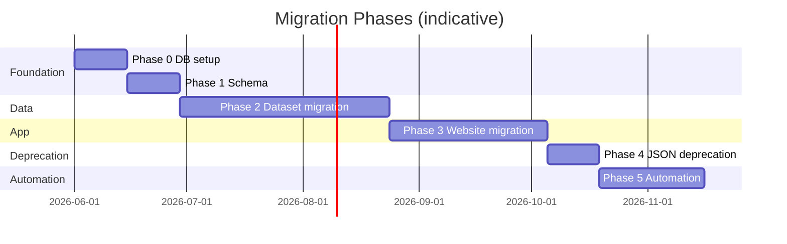

# SA Data Hub — PostgreSQL Migration Plan

Phased strategy to migrate from static JSON (`src/data/datasets/`) to PostgreSQL while keeping the live site functional at every step.

**Constraint:** At the end of every phase, [sadatahub.tech](https://sadatahub.tech) works correctly.

---

## Overview



Phases can overlap slightly (e.g. start Phase 3 for dataset A while migrating dataset B).

---

## Phase 0 — Database Setup

**Goal:** Provision infrastructure; zero visible site changes.

### Tasks

| # | Task | Owner |
|---|------|-------|
| 0.1 | Create Neon project (see `.neon` for existing IDs) | Dev |
| 0.2 | Add `DATABASE_URL` to `.env.local` (gitignored) | Dev |
| 0.3 | Create `.env.example` with `DATABASE_URL=` placeholder | Dev |
| 0.4 | Verify `GET /api/test-db` returns `success: true` | Dev |
| 0.5 | Create `db/migrations/` folder convention | Dev |

### Exit criteria

- [ ] Local and Vercel preview can connect to Neon
- [ ] Site still 100% JSON-backed
- [ ] No secrets in git

### Rollback

Delete Neon branch; remove env vars. No app impact.

---

## Phase 1 — Schema Creation

**Goal:** Apply full schema from [database-schema.md](./database-schema.md); seed reference data.

### Tasks

| # | Task |
|---|------|
| 1.1 | Write `db/migrations/001_initial_schema.sql` — all tables |
| 1.2 | Write `002_indexes.sql` — indexes, views, `pg_trgm` |
| 1.3 | Write `003_constraints.sql` — natural-key unique constraints |
| 1.4 | Write `004_seed_reference_data.sql` — categories, sources, geographies, dataset metadata |
| 1.5 | Apply migrations: `npm run db:migrate` |
| 1.6 | Create `src/lib/db/` query stubs (no page wiring yet) |

Regenerate seed SQL after JSON changes: `npm run db:seed:generate`

### Seed data sources

- Provinces/municipalities: current JSON files
- Categories: `mock.ts` `categories` array
- Data sources: `methodology/page.tsx` provider list

### Exit criteria

- [ ] `\dt` shows all tables
- [ ] 9 provinces + 213 municipalities in `geographies`
- [ ] Empty `observations` — OK at this stage

### Rollback

`DROP SCHEMA public CASCADE; CREATE SCHEMA public;` on dev branch only. Production: restore from Neon point-in-time recovery.

---

## Phase 2 — Dataset Migration

**Goal:** Load each dataset into PostgreSQL with equivalence proofs.

### Order (smallest risk first)

| Order | Dataset | Rationale |
|-------|---------|-----------|
| 1 | `census` | Static; small |
| 2 | `population` | Simple annual series |
| 3 | `education` | Annual; manual |
| 4 | `crime` | Annual; manual |
| 5 | `housing` | Small |
| 6 | `interest-rates` | Few points |
| 7 | `gdp` | Quarterly |
| 8 | `inflation` | Monthly + annual |
| 9 | `unemployment` + youth + labour-force | Related; fix duplicate IDs first |
| 10 | `provinces` | Composite snapshot |
| 11 | `municipalities` | Largest; last |

### Per-dataset checklist

```
[ ] Write etl/pipelines/{slug}
[ ] Run extract → transform → validate → load
[ ] Write src/lib/db/{slug}.ts query functions
[ ] Write equivalence test: JSON mock === DB query
[ ] Insert update_events row
[ ] PR review with diff summary
```

### Exit criteria

- [ ] All datasets loaded in PostgreSQL
- [ ] Equivalence tests pass in CI
- [ ] JSON files still present (dual-read period)

### Rollback

Truncate `observations` for affected `dataset_id`; site still reads JSON.

---

## Phase 3 — Website Migration

**Goal:** Switch pages from `mock.ts` to `lib/db` behind feature flag.

### Pattern

```typescript
// src/lib/data-source.ts
export async function getStatsByCategory(categoryId: string) {
  if (process.env.DATA_SOURCE === 'db') {
    return dbGetStatsByCategory(categoryId)
  }
  return mockGetStatsByCategory(categoryId)
}
```

### Page migration order

| Order | Page | Complexity |
|-------|------|------------|
| 1 | `/updates` | Read-only log |
| 2 | `/downloads` | Registry + export |
| 3 | `/category/[slug]` | One category pilot (census) |
| 4 | Remaining categories | |
| 5 | `/provinces`, `/provinces/[id]` | Snapshot table |
| 6 | `/dashboard` | Search still client-side initially |
| 7 | `/municipalities/*` | Largest; SQL search/filter |

### Exit criteria

- [ ] `DATA_SOURCE=db` in production
- [ ] All pages render correctly
- [ ] CSV export matches previous output
- [ ] Citations unchanged

### Rollback

Set `DATA_SOURCE=json` in Vercel env — instant revert, no redeploy of data.

---

## Phase 4 — JSON Deprecation

**Goal:** Remove JSON as source of truth; keep archives only.

### Tasks

| # | Task |
|---|------|
| 4.1 | Remove JSON imports from `mock.ts`; delete or gut file |
| 4.2 | Move `src/data/datasets/` to `etl/archives/json-snapshots/` OR stop committing updates |
| 4.3 | Remove dual-write from ETL |
| 4.4 | Update README and docs |
| 4.5 | Delete `update-history.ts` — replaced by DB |

### Exit criteria

- [ ] Build succeeds with no dataset JSON imports in app bundle
- [ ] Bundle size decreases (municipalities.json no longer bundled)
- [ ] `registry.ts` reads from DB or generated types

### Rollback

Re-enable JSON imports from git tag; flip `DATA_SOURCE=json`.

---

## Phase 5 — Automation

**Goal:** Scheduled ETL; alerting; ISR revalidation.

### Tasks

| # | Task |
|---|------|
| 5.1 | `.github/workflows/ci.yml` — lint, typecheck, equivalence tests |
| 5.2 | `.github/workflows/data-update.yml` — cron per [etl-pipeline.md](./etl-pipeline.md) |
| 5.3 | Failure notifications (GitHub issue or email) |
| 5.4 | `revalidatePath` / `revalidateTag` after successful load |
| 5.5 | Public API (`/api/v1/*`) — see [api-design.md](./api-design.md) |
| 5.6 | Retire hand-maintained `update-history.ts` fully |

### Exit criteria

- [ ] At least one dataset updates without manual intervention
- [ ] Failed run generates visible alert within 15 minutes
- [ ] Category page reflects new data without full manual deploy (ISR)

### Rollback

Disable GitHub Actions workflow; manual pipeline runs.

---

## Risks and Mitigations

| Risk | Likelihood | Impact | Mitigation |
|------|------------|--------|------------|
| Stats SA format change | Medium | High | Archive raw; schema validation; alert on row count drop |
| Neon connection limits (serverless) | Medium | Medium | Connection pooling; edge vs node runtime care |
| Equivalence drift JSON↔DB | High | High | Automated diff tests in CI |
| Build time with DB at build | Medium | Medium | ISR instead of full SSG for data pages |
| Duplicate stat IDs cause wrong joins | High | High | Fix in Phase 2 pre-load |
| World Bank vs Stats SA mismatch | High | Medium | Label WB data `is_estimate`; prioritize Stats SA extract |
| SEO regression on URL change | Low | Critical | Never change URL patterns |
| Secret leak in CI | Low | Critical | GitHub secrets only; scan commits |

---

## Rollback Plans (Summary)

| Phase | Rollback mechanism | RTO |
|-------|-------------------|-----|
| 0–1 | Ignore DB; no app dependency | Immediate |
| 2 | Don't flip `DATA_SOURCE` | Immediate |
| 3 | `DATA_SOURCE=json` env var | < 1 minute |
| 4 | Restore JSON from git tag + env flip | < 1 hour |
| 5 | Disable cron; manual updates | < 1 hour |

**Neon:** Use branch for dev/staging; point-in-time recovery for production disasters.

---

## Testing Strategy

### Unit tests

| Module | Priority |
|--------|----------|
| `lib/citation.ts` | High |
| `lib/registry.ts` | High |
| `lib/insights.ts` | High |
| `etl/transform/periods.py` | High |
| `lib/db/*.ts` | High after Phase 2 |

### Integration tests

- Load sample fixture to test Neon branch
- API route returns expected JSON shape

### Equivalence tests

```typescript
// tests/equivalence/unemployment.test.ts
test('DB matches JSON for unemployment-national series', async () => {
  const jsonSeries = getStatById('unemployment-national')!.series![0].data
  const dbSeries = await getObservationSeries('unemployment-national', 'ZA')
  expect(dbSeries).toEqual(jsonSeries)
})
```

### Manual QA checklist (per page migration)

- [ ] Stat cards show correct values
- [ ] Charts render all data points
- [ ] Freshness badge correct
- [ ] CSV export downloads
- [ ] Citations copy correctly
- [ ] Mobile layout intact
- [ ] Dark mode charts readable

### Performance tests

- Municipality list query < 100ms (p95)
- Category page DB queries < 50ms total
- API endpoint < 200ms (p95)

---

## Success Metrics

| Metric | Target |
|--------|--------|
| Datasets in PostgreSQL | 12/12 registry + municipalities |
| Manual steps per quarterly update | 0 (post Phase 5) |
| Data correction deploy time | < 30 min (ETL + revalidate) |
| Equivalence test coverage | 100% of statistics with series |
| Uptime during migration | 100% (no planned downtime) |

---

## Post-Migration Cleanup

- Rename `mock.ts` → `src/lib/data/legacy.ts` or delete
- Consolidate `scripts/` into `etl/`
- Add `docs/decisions/` ADRs
- Update README (Next.js version, data architecture)
- Consider Drizzle ORM if raw SQL becomes unwieldy

---

## Related Documents

- [database-schema.md](./database-schema.md) — table definitions
- [etl-pipeline.md](./etl-pipeline.md) — pipeline design
- [api-design.md](./api-design.md) — Phase 5 API surface
- [SA-Data-Hub-Architecture-Review.md](../SA-Data-Hub-Architecture-Review.md) — original phase plan
